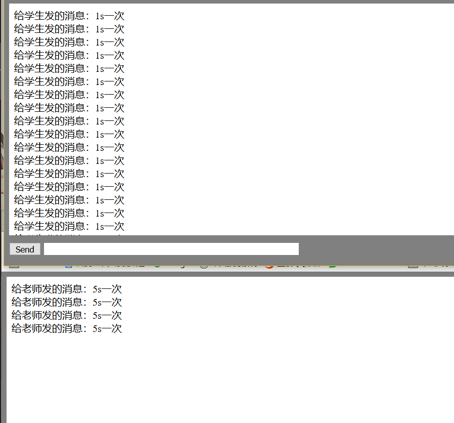
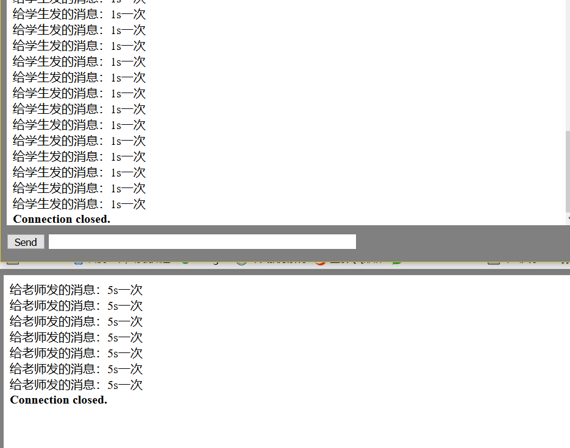

# Gin-Websocket-Demo
### 1. 效果展示

使用Gin框架，使用websocket媒介，向特定用户发送通知

- 运行

`go run .`

服务端开启。

- 使用浏览器登录：

`localhost:8082/user/123456@qq.com/login`

即可以默认学生身份websocket链接至服务端，并一秒钟收到一次通知。

- 更改身份：

不关闭服务器的情况下，在home.html里面将identity改为teacher，保存后在另一个浏览器窗口登录，即可以teacher身份登录，收到5s一次的通知。

- 用户关闭浏览器后，后台将在一段时间内关闭通知对其通知服务。服务端后台关闭时，所有通知前端均关闭。

### 2. API 接口

1. 登录API：

/user/{email{/login

2. websocket自动连接API：

/ws?identity=[身份]